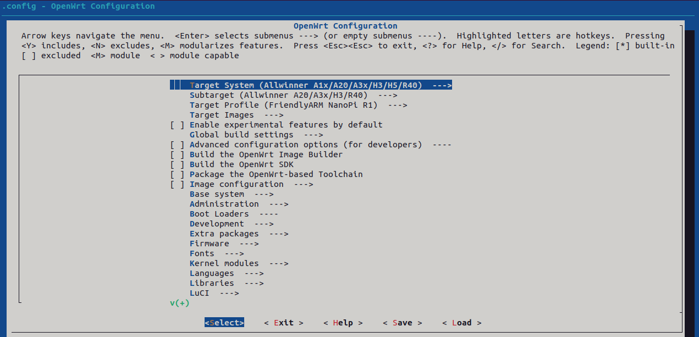

# OpenWrt for NanoPi R1

This repository provides instructions for building an OpenWrt image for the NanoPi R1.

---

## Prerequisites

Before starting, ensure you have the following installed on your system:

- Ubuntu 20.04 or later (recommended)
- Required packages:
  ```bash
  sudo apt update
  sudo apt install build-essential libncurses5-dev libncursesw5-dev zlib1g-dev gawk git gettext libssl-dev xsltproc rsync wget unzip python3
  ```
## Build image
  ```bash
  git clone https://git.openwrt.org/openwrt/openwrt.git
  cd openwrt
  ./scripts/feeds update -a
  ./scripts/feeds install -a
  make menuconfig
  ```
 

